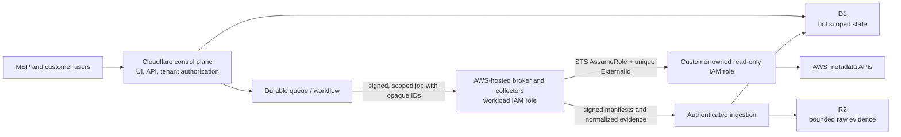

# Sutra

Sutra is a production-shaped foundation for a multi-tenant MSP AWS
configuration management database (CMDB) and cloud security posture management
(CSPM) service. The intended first release gives MSP teams and their customers a
read-only inventory, resource relationships, evidence-backed configuration checks,
and scoped access to findings.

> **Local pilot boundary:** the application supports one persistent local MSP
> workspace, local identities with enforced MFA/RBAC, and multiple deterministic
> simulated customer accounts. Simulation runs use a signed collector-owned fixture
> catalog, durable local jobs, strict result verification, explicit D1 publication,
> immutable CMDB snapshots, and finding/change-history workflows. Live mode remains
> separately gated for a disposable AWS sandbox trust role. Every screen labels the
> active evidence source; simulated results must never be represented as customer AWS
> observations.

This repository is an implementation foundation and an EKS-first private beta,
not a generally available, independently penetration-tested or SLA-backed
service. It does not replace Amazon Inspector, Amazon GuardDuty, AWS Security
Hub, an EDR agent, or human incident response. In addition to deterministic
configuration checks, the private beta now accepts bounded real evidence from
Trivy Operator, Falco, Kyverno and Cilium/Hubble through cluster-bound ingestion
paths. Missing telemetry is always reported as not configured, partial or stale.

The verified local demo now also includes tenant-scoped Cost Explorer evidence;
CUR 2.0 and FOCUS 1.0 ingestion, allocation, budgets and anomaly signals; a
versioned, scoped public API v1; and signed bidirectional Jira/ServiceNow
synchronization. CMDB query/annotation workflows, finding-backed case management,
approval-controlled compliance exceptions, bounded CloudTrail LookupEvents
normalization/detections, and expanded metadata collectors for EBS, ENI, ALB/NLB,
KMS, DynamoDB, and ECR are also implemented. Lambda inventory remains off because
`ListFunctions` can expose environment-variable values. These local capabilities
do not clear the hosted production gates below and are not presented as a
Cloudaware, GuardDuty, Inspector, Security Hub, SIEM, billing-reconciliation, or
vendor-certified ITSM replacement.

The hosted identity foundation now includes the real Cognito/OIDC PKCE callback
boundary and an MFA-protected, single-use organization invitation lifecycle.
Hosted release remains blocked on the remaining tenant-isolation, recovery,
rate-limit and broker gates documented below.

The Kubernetes private-beta capability matrix, validation sequence and remaining
general-availability gates are documented in
[`docs/enterprise-kubernetes-private-beta.md`](docs/enterprise-kubernetes-private-beta.md).

## Bounded first-release scope

The first production slice is intentionally read-only.

Included in the target slice:

- MSP organizations, customer workspaces, memberships, invitations, and explicit
  customer-scoped roles.
- Per-account onboarding through a customer-owned IAM trust role, with a unique
  platform-generated ExternalId and the exact vendor collector principal.
- Normalized, timestamped AWS resource inventory, tags, relationships, changes,
  collection coverage, and data freshness.
- Initial collection for EC2 and VPC networking, security groups, load balancers,
  RDS, S3 configuration metadata, ECS/EKS, IAM metadata, CloudTrail, and related
  account-level posture signals. Each adapter must ship with pagination, throttling,
  permission, region, and partial-result tests before it is enabled.
- Versioned, deterministic CSPM controls with evidence, severity rationale,
  `pass`/`fail`/`unknown`/`error` results, findings, suppression expiry, and audit
  history.
- Optional read-only import of findings from native AWS security services that the
  customer has already enabled. Sutra does not enable or configure those
  billable services.
- Tenant-scoped public API access and Jira/ServiceNow case synchronization, after
  hosted gateway, managed-secret, delivery-worker and vendor-sandbox gates are
  cleared.

Explicitly outside the first slice:

- Resource changes, automatic remediation, shell access, `iam:PassRole`, credential
  creation, or any other mutation in customer accounts.
- Inspector-equivalent host/Lambda dependency coverage or managed vulnerability
  intelligence. Trivy image/configuration/SBOM evidence is available for enrolled
  Kubernetes clusters.
- GuardDuty-equivalent threat intelligence, anomaly detection or managed detection
  operations. Falco runtime events and bounded Hubble metadata are optional cluster
  evidence sources, not GuardDuty parity.
- Security Hub-equivalent standards coverage, delegated administration, ASFF
  federation, or cross-product normalization.
- Customer invoicing, marketplace metering, SAML/SCIM, PSA integrations, data
  residency selection, or customer-managed keys. Local FinOps analytics and
  Jira/ServiceNow synchronization are implemented, but they are not billing-grade
  reconciliation or vendor-certified production integrations. Email, Slack and
  Teams notification configuration/outbox support exists, but provider delivery
  requires hosted managed-secret and workload-identity adapters.

Future resource management must be a separate remediation plane with a different
customer role, narrowly scoped per-action permissions, dry-run/diff, approval,
step-up authentication, idempotency, rollback guidance, and immutable before/after
audit evidence. Write permissions must never be added to the CMDB collector role.

## Architecture

The production design deliberately separates the internet-facing control plane
from AWS credentials and STS access:



The Cloudflare control plane owns user interaction, tenant authorization, CMDB
queries, finding views, and job coordination. D1 is the hot relational index; R2 is
the planned store for compressed raw snapshots and large evidence. Durable jobs
handle collection and evaluation outside web requests.

The AWS broker is a separate AWS-hosted service (for example Lambda, ECS, and/or
Step Functions) with its own workload IAM role. It resolves a registered connection
server-side, obtains short-lived STS credentials, collects only allowlisted metadata,
and never returns credentials to the control plane or browser. The broker endpoint
must authenticate the control plane, reject replay, enforce tenant/connection scope,
and rate-limit work. A browser, generic web handler, D1 row, or Cloudflare variable
must never contain a durable vendor AWS access key.

The diagram is the hosted target architecture. The repository implements its local
equivalent: a tenant-scoped control-plane API, D1 snapshots, a signed replay-resistant
loopback broker boundary, encrypted connection material, behavioral trust probes,
selected service-specific inventory adapters, and tenant-scoped durable job,
retry/backoff, lease and DLQ primitives. It does not yet contain the deployed hosted
queue/workflow workers, managed secret service, R2 evidence path, deployed AWS
worker fleet, or production multi-tenant identity and authorization plane.

## Trust-role onboarding

The intended onboarding contract is:

1. An authorized MSP administrator creates a pending connection. The server
   generates a high-entropy ExternalId unique to that connection.
2. The customer reviews and deploys a versioned CloudFormation template. Its trust
   policy names the exact vendor collector workload-role ARN and requires the
   generated ExternalId. It must not trust the vendor account root or `*`.
3. The AWS broker—not the browser—resolves the stored role ARN and ExternalId, calls
   `AssumeRole`, then requires `GetCallerIdentity` to match the registered account
   and partition.
4. Validation must also prove that assumption fails when the ExternalId is omitted
   and when it is wrong. A role that passes either negative probe is rejected.
5. Temporary STS credentials stay only in collector memory. They are never written
   to D1/R2, queues, logs, traces, browser responses, or support artifacts.
6. Only a complete, authenticated, checksummed collection can replace the current
   CMDB snapshot. Partial or failed runs cannot retire unseen resources.

The template in `infrastructure/customer-role.yaml` is a design artifact for review
and controlled sandbox testing. It is not evidence that the vendor broker, tenant
isolation, validation probes, or operational controls exist.

## Production hold: P0 gates

**Do not deploy the customer-role template into a production AWS account, register a
live production role ARN, or onboard production customer data until every P0 gate is
implemented, independently tested, and approved.** Use synthetic/demo data or a
disposable sandbox while this hold is in place.

The minimum P0 exit gates are:

| Area | Required evidence before production AWS access |
| --- | --- |
| Identity | Production OIDC/session lifecycle, MFA/step-up policy, CSRF protection, invitation expiry and revocation |
| Tenant isolation | Central server authorization plus negative tests across at least two organizations and customers for every route, job, cache, object, and export |
| AWS broker | Deployed AWS workload identity, authenticated/replay-resistant broker protocol, fixed action/role allowlists, short STS sessions, and no long-lived AWS keys |
| Trust validation | Canonical ARN/account/partition checks, restrictive STS session policy, fetched role/trust-policy attestation, `GetCallerIdentity`, identical-field correct/missing/wrong ExternalId probes, disable, and truthful local offboarding tests. Rotation is rejected until a two-phase AWS-side workflow is implemented. |
| Job integrity | Durable outbox/queue, scoped opaque payloads, leases, idempotency, retries/backoff, deadlines, cancellation, DLQ, and audited replay |
| CMDB integrity | Paginated collectors, schema/size validation, manifests/checksums, atomic complete-run promotion, provenance, partial coverage, and safe retirement behavior |
| Secrets and privacy | Managed encryption and key rotation, environment separation, allowlist logging/redaction tests, retention/deletion behavior, and canary credential scans |
| Control quality | Versioned deterministic rules, fixtures, permission contracts, `unknown` on missing evidence, false-positive notes, and remediation review |
| Operations | Monitoring/SLOs, audit export, backup/restore and recovery drills, quotas, incident response, compromised-role revocation, and customer offboarding runbooks |
| Release assurance | Required CI, dependency/IaC/secret scanning, staging and sandbox acceptance tests, threat-model review, penetration-test closure, and explicit release approval |

The complete architecture and acceptance criteria are in
[`docs/architecture.md`](docs/architecture.md),
[`docs/aws-integration.md`](docs/aws-integration.md), and
[`docs/security-and-quality.md`](docs/security-and-quality.md).

## Local development

Prerequisites:

- A current Node.js 22 LTS patch (`>=22.13.0` is the package engine floor)
- pnpm 11.13.1 (the repository's canonical install input is `pnpm-lock.yaml`)

```bash
corepack enable
corepack prepare pnpm@11.13.1 --activate
pnpm install --frozen-lockfile
pnpm pilot:setup
pnpm dev:pilot
```

Open `http://localhost:3000/login`, create the first local owner with the one-time
token from `pnpm local:bootstrap-token`, and enroll MFA. Then open
`http://localhost:3000/operations` to run and publish a signed simulated account
snapshot. Setup creates permission-restricted secrets in ignored `.dev.vars` and
durable local state under ignored `.sutra/`. Fixture mode is the default and requires
no AWS account. See
[`docs/local-demo.md`](docs/local-demo.md) for the reliable sales-demo flow and the
separate live AWS sandbox procedure. The `DB` D1 binding is declared in
`.openai/hosting.json` and simulated locally by the development stack.

For a laptop demo backed by a real persistent PostgreSQL database, Docker Desktop
can run the web application, collector, and PostgreSQL together:

```bash
pnpm docker:up
```

The command generates ignored high-entropy owner/runtime database secrets, applies migrations,
and waits for the complete stack to become healthy. See
[`docs/local-postgres.md`](docs/local-postgres.md) for restart persistence,
integration testing, backup, restore, and reset procedures. Database volumes,
runtime secrets, backups, AWS inventory, and customer evidence are deliberately
excluded from Git; GitHub stores the source and migrations, never live customer data.

Never use a production AWS access key locally. Real broker development must use an
isolated sandbox AWS account, workload identity or short-lived developer federation,
and separate non-production roles and keys. Do not paste a real RoleArn, ExternalId,
session token, customer inventory, or finding evidence into `.env`, fixtures, tests,
screenshots, logs, issues, or pull requests.

## Repository layout

| Path | Purpose and current status |
| --- | --- |
| `app/` | vinext/React control plane, real local onboarding, dashboard, CMDB, findings, cases, security events, compliance, FinOps and exports |
| `lib/` | Domain types, cryptographic/request boundaries, payload validation, and control definitions |
| `db/` | Drizzle/D1/PostgreSQL connection, sync, immutable snapshot, relationship, finding, case, exception, security-event, cost and audit repositories |
| `infrastructure/` | Customer read-only IAM role template for controlled sandbox use |
| `services/aws-collector/` | Signed loopback broker, encrypted registry, fixture/live runners, STS trust validation, and AWS adapters |
| `docs/` | Production architecture, AWS integration, threat model, quality gates, and acceptance criteria |
| `tests/` | Deterministic domain, API, repository, tenant-isolation, collector, Kubernetes and rendered-route tests; targeted negative isolation tests exist, but production isolation-under-load and independent assurance remain gates |
| `public/` | Static assets and a downloadable copy of the customer-role template |
| `worker/`, `build/` | Cloudflare/vinext worker and local hosting integration |

## Verification

Run the same checks as CI:

```bash
pnpm security:secrets
pnpm typecheck
pnpm typecheck:collector
pnpm lint
pnpm test
pnpm test:kubernetes
pnpm test:enterprise-security
pnpm test:phase2
pnpm test:collector
pnpm db:postgres:test
pnpm build
pnpm test:rendered
```

`pnpm verify` runs that complete sequence.

CI intentionally follows the checked-in scripts and frozen pnpm lockfile. Passing
these checks proves only that the current code compiles, lints, builds, and passes
its current control-engine and rendered-route tests; it does not satisfy the
production P0 gates above.

## Deployment posture

`pnpm build` creates a deployable web artifact; it does not authorize a production
release. This repository intentionally has no automatic production deployment in
CI. Development, staging, and production must use separate Cloudflare resources,
AWS accounts/principals, broker identities, encryption/signing keys, queues, and data
stores. Deployment automation must use short-lived OIDC federation rather than
stored cloud access keys, pin the reviewed artifact digest, run forward-only
migrations, and require environment approval for production.

Until the P0 hold is cleared, use fixture mode or an isolated sandbox AWS account.
A polished dashboard, successful role validation, or one-account scan is not proof
of multi-tenant production readiness.

## Roadmap

See the detailed [Cloud operations parity roadmap](docs/cloudaware-parity-roadmap.md)
for a delivered-versus-future capability matrix covering the current local pilot,
the locally delivered CMDB, compliance, FinOps, public API and ITSM slices, their
hosted production gates, broader AWS CSPM and native finding imports, remediation,
SIEM/PSA integrations, and the Azure/GCP/Kubernetes research horizon. It is a
sequencing document, not a Cloudaware parity claim or release-date commitment.

1. **P0 security foundation:** production identity, memberships and customer grants,
   centralized authorization, tenant-safe repositories, audit/outbox primitives,
   migrations, and multi-tenant negative tests.
2. **P0 AWS connection:** deploy the isolated broker, authenticated job protocol,
   STS trust probes, connection lifecycle, and one production-quality VPC/security
   group collector in sandbox accounts.
3. **CMDB and controls:** durable sync/reconciliation, inventory provenance and
   relationships, control-version/evaluation/finding lifecycle, coverage reporting,
   and initial reviewed CSPM pack.
4. **Operational readiness:** quotas, observability, backups/restores, retention and
   deletion, incident/offboarding runbooks, staging load/failure tests, and security
   assessment closure.
5. **Controlled expansion:** additional collectors and native AWS finding imports,
   then integrations and enterprise identity only after the core isolation and
   reliability envelope is measured.
6. **Separate future products:** opt-in remediation with a distinct write role;
   package vulnerability coverage only with a real inventory/SBOM/CVE pipeline; and
   behavioral detection only with the required event telemetry and response
   operations.

See [`CONTRIBUTING.md`](CONTRIBUTING.md) before changing tenant, IAM, collector,
control, or deployment boundaries. Report security issues through the private
process in [`SECURITY.md`](SECURITY.md).
