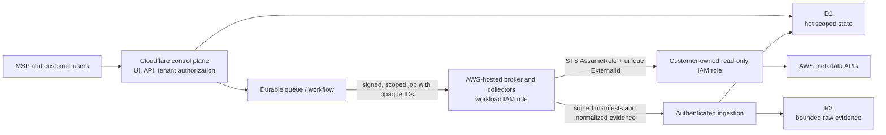

# Palisade Cloud

Palisade Cloud is a production-shaped foundation for a multi-tenant MSP AWS
configuration management database (CMDB) and cloud security posture management
(CSPM) service. The intended first release gives MSP teams and their customers a
read-only inventory, resource relationships, evidence-backed configuration checks,
and scoped access to findings.

> **Demo data only:** the application currently renders seeded customers, assets,
> findings, controls, and sync status from local fixtures. The onboarding screen
> validates form syntax in the browser and shows a preview ExternalId; it does not
> persist a connection, call AWS STS, validate a trust policy, or scan an account.
> Do not enter real credentials or treat anything shown as a live security result.

This repository is an implementation foundation, not a production-ready service.
It does not replace Amazon Inspector, Amazon GuardDuty, AWS Security Hub, an EDR
agent, or human incident response. Palisade's initial controls are deterministic
configuration checks. Package/runtime vulnerability analysis and behavioral threat
detection need different telemetry, detection engineering, and operational response
capabilities.

## Bounded first-release scope

The first production slice is intentionally read-only.

Included in the target slice:

- MSP organizations, customer workspaces, memberships, invitations, and explicit
  customer-scoped roles.
- Per-account onboarding through a customer-owned IAM trust role, with a unique
  platform-generated ExternalId and the exact vendor collector principal.
- Normalized, timestamped AWS resource inventory, tags, relationships, changes,
  collection coverage, and data freshness.
- Initial collection for EC2 and VPC networking, security groups, load balancers,
  RDS, S3 configuration metadata, ECS/EKS, IAM metadata, CloudTrail, and related
  account-level posture signals. Each adapter must ship with pagination, throttling,
  permission, region, and partial-result tests before it is enabled.
- Versioned, deterministic CSPM controls with evidence, severity rationale,
  `pass`/`fail`/`unknown`/`error` results, findings, suppression expiry, and audit
  history.
- Optional read-only import of findings from native AWS security services that the
  customer has already enabled. Palisade does not enable or configure those
  billable services.

Explicitly outside the first slice:

- Resource changes, automatic remediation, shell access, `iam:PassRole`, credential
  creation, or any other mutation in customer accounts.
- Inspector-equivalent package, image, Lambda dependency, SBOM, or CVE coverage.
- GuardDuty-equivalent analysis of CloudTrail, VPC Flow Logs, DNS, Kubernetes audit
  logs, threat intelligence, or anomalous behavior.
- Security Hub-equivalent standards coverage, delegated administration, ASFF
  federation, or cross-product normalization.
- Billing, marketplace metering, SAML/SCIM, ticketing/chat integrations, data
  residency selection, or customer-managed keys.

Future resource management must be a separate remediation plane with a different
customer role, narrowly scoped per-action permissions, dry-run/diff, approval,
step-up authentication, idempotency, rollback guidance, and immutable before/after
audit evidence. Write permissions must never be added to the CMDB collector role.

## Architecture

The production design deliberately separates the internet-facing control plane
from AWS credentials and STS access:



The Cloudflare control plane owns user interaction, tenant authorization, CMDB
queries, finding views, and job coordination. D1 is the hot relational index; R2 is
the planned store for compressed raw snapshots and large evidence. Durable jobs
handle collection and evaluation outside web requests.

The AWS broker is a separate AWS-hosted service (for example Lambda, ECS, and/or
Step Functions) with its own workload IAM role. It resolves a registered connection
server-side, obtains short-lived STS credentials, collects only allowlisted metadata,
and never returns credentials to the control plane or browser. The broker endpoint
must authenticate the control plane, reject replay, enforce tenant/connection scope,
and rate-limit work. A browser, generic web handler, D1 row, or Cloudflare variable
must never contain a durable vendor AWS access key.

The diagram is the target production architecture. The current repository contains
the demo web surface, domain/schema foundation, a reviewable customer-role template,
and a tested AWS-side STS credential-boundary package. It does not yet contain the
production queue, authenticated ingestion boundary, R2 evidence path, deployed AWS
broker, or service-specific inventory adapters.

## Trust-role onboarding

The intended onboarding contract is:

1. An authorized MSP administrator creates a pending connection. The server
   generates a high-entropy ExternalId unique to that connection.
2. The customer reviews and deploys a versioned CloudFormation template. Its trust
   policy names the exact vendor collector workload-role ARN and requires the
   generated ExternalId. It must not trust the vendor account root or `*`.
3. The AWS broker—not the browser—resolves the stored role ARN and ExternalId, calls
   `AssumeRole`, then requires `GetCallerIdentity` to match the registered account
   and partition.
4. Validation must also prove that assumption fails when the ExternalId is omitted
   and when it is wrong. A role that passes either negative probe is rejected.
5. Temporary STS credentials stay only in collector memory. They are never written
   to D1/R2, queues, logs, traces, browser responses, or support artifacts.
6. Only a complete, authenticated, checksummed collection can replace the current
   CMDB snapshot. Partial or failed runs cannot retire unseen resources.

The template in `infrastructure/customer-role.yaml` is a design artifact for review
and controlled sandbox testing. It is not evidence that the vendor broker, tenant
isolation, validation probes, or operational controls exist.

## Production hold: P0 gates

**Do not deploy the customer-role template into a production AWS account, register a
live production role ARN, or onboard production customer data until every P0 gate is
implemented, independently tested, and approved.** Use synthetic/demo data or a
disposable sandbox while this hold is in place.

The minimum P0 exit gates are:

| Area | Required evidence before production AWS access |
| --- | --- |
| Identity | Production OIDC/session lifecycle, MFA/step-up policy, CSRF protection, invitation expiry and revocation |
| Tenant isolation | Central server authorization plus negative tests across at least two organizations and customers for every route, job, cache, object, and export |
| AWS broker | Deployed AWS workload identity, authenticated/replay-resistant broker protocol, fixed action/role allowlists, short STS sessions, and no long-lived AWS keys |
| Trust validation | Canonical ARN/account/partition checks, `GetCallerIdentity`, correct-ExternalId success, missing/wrong-ExternalId failure, rotation, disable, and offboarding tests |
| Job integrity | Durable outbox/queue, scoped opaque payloads, leases, idempotency, retries/backoff, deadlines, cancellation, DLQ, and audited replay |
| CMDB integrity | Paginated collectors, schema/size validation, manifests/checksums, atomic complete-run promotion, provenance, partial coverage, and safe retirement behavior |
| Secrets and privacy | Managed encryption and key rotation, environment separation, allowlist logging/redaction tests, retention/deletion behavior, and canary credential scans |
| Control quality | Versioned deterministic rules, fixtures, permission contracts, `unknown` on missing evidence, false-positive notes, and remediation review |
| Operations | Monitoring/SLOs, audit export, backup/restore and recovery drills, quotas, incident response, compromised-role revocation, and customer offboarding runbooks |
| Release assurance | Required CI, dependency/IaC/secret scanning, staging and sandbox acceptance tests, threat-model review, penetration-test closure, and explicit release approval |

The complete architecture and acceptance criteria are in
[`docs/architecture.md`](docs/architecture.md),
[`docs/aws-integration.md`](docs/aws-integration.md), and
[`docs/security-and-quality.md`](docs/security-and-quality.md).

## Local development

Prerequisites:

- A current Node.js 22 LTS patch (`>=22.13.0` is the package engine floor)
- pnpm 10 (the repository's canonical install input is `pnpm-lock.yaml`)

```bash
corepack enable
corepack prepare pnpm@10.13.1 --activate
pnpm install --frozen-lockfile
pnpm dev
```

Open the local URL printed by the development server. The current demo needs no AWS
credentials or application secrets. The `DB` D1 binding is declared in
`.openai/hosting.json` and simulated locally by the development stack.

Never use a production AWS access key locally. Real broker development must use an
isolated sandbox AWS account, workload identity or short-lived developer federation,
and separate non-production roles and keys. Do not paste a real RoleArn, ExternalId,
session token, customer inventory, or finding evidence into `.env`, fixtures, tests,
screenshots, logs, issues, or pull requests.

## Repository layout

| Path | Purpose and current status |
| --- | --- |
| `app/` | vinext/React demo UI, including dashboard, controls, and simulated onboarding |
| `lib/` | Domain types, seeded demo records, and deterministic example controls |
| `db/` | Drizzle/D1 schema and database binding foundation |
| `infrastructure/` | Customer read-only IAM role template for review/sandbox use |
| `services/aws-collector/` | AWS-hosted STS role broker and job boundary with injected fake-STS tests; not a deployed collector fleet |
| `docs/` | Production architecture, AWS integration, threat model, quality gates, and acceptance criteria |
| `tests/` | Deterministic control tests and rendered-HTML route smoke tests; not yet the required tenant-isolation suite |
| `public/` | Static assets and a downloadable copy of the customer-role template |
| `worker/`, `build/` | Cloudflare/vinext worker and local hosting integration |

## Verification

Run the same checks as CI:

```bash
pnpm typecheck
pnpm typecheck:collector
pnpm lint
pnpm test
pnpm test:collector
pnpm build
pnpm test:rendered
```

`pnpm verify` runs that complete sequence.

CI intentionally follows the checked-in scripts and frozen pnpm lockfile. Passing
these checks proves only that the current code compiles, lints, builds, and passes
its current control-engine and rendered-route tests; it does not satisfy the
production P0 gates above.

## Deployment posture

`pnpm build` creates a deployable web artifact; it does not authorize a production
release. This repository intentionally has no automatic production deployment in
CI. Development, staging, and production must use separate Cloudflare resources,
AWS accounts/principals, broker identities, encryption/signing keys, queues, and data
stores. Deployment automation must use short-lived OIDC federation rather than
stored cloud access keys, pin the reviewed artifact digest, run forward-only
migrations, and require environment approval for production.

Until the P0 hold is cleared, deploy only the demo UI or an isolated test stack with
synthetic data. A polished dashboard or a successful CloudFormation deployment is
not production readiness.

## Roadmap

1. **P0 security foundation:** production identity, memberships and customer grants,
   centralized authorization, tenant-safe repositories, audit/outbox primitives,
   migrations, and multi-tenant negative tests.
2. **P0 AWS connection:** deploy the isolated broker, authenticated job protocol,
   STS trust probes, connection lifecycle, and one production-quality VPC/security
   group collector in sandbox accounts.
3. **CMDB and controls:** durable sync/reconciliation, inventory provenance and
   relationships, control-version/evaluation/finding lifecycle, coverage reporting,
   and initial reviewed CSPM pack.
4. **Operational readiness:** quotas, observability, backups/restores, retention and
   deletion, incident/offboarding runbooks, staging load/failure tests, and security
   assessment closure.
5. **Controlled expansion:** additional collectors and native AWS finding imports,
   then integrations and enterprise identity only after the core isolation and
   reliability envelope is measured.
6. **Separate future products:** opt-in remediation with a distinct write role;
   package vulnerability coverage only with a real inventory/SBOM/CVE pipeline; and
   behavioral detection only with the required event telemetry and response
   operations.

See [`CONTRIBUTING.md`](CONTRIBUTING.md) before changing tenant, IAM, collector,
control, or deployment boundaries. Report security issues through the private
process in [`SECURITY.md`](SECURITY.md).
