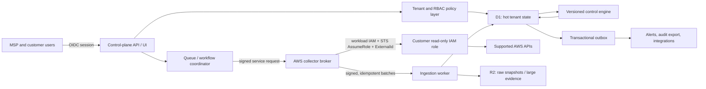
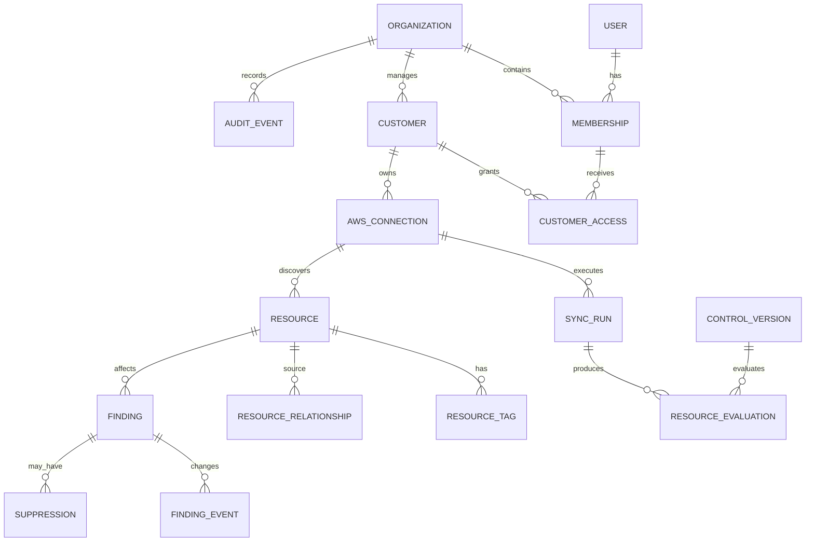

# Production first-slice architecture: MSP CMDB and AWS security posture platform

**Status:** proposed architecture baseline  
**Date:** 2026-07-15  
**Applies to:** the current Cloudflare Worker/vinext/D1 prototype and the production services that must be added around it

## 1. Executive decision

Build the first sellable slice as a **read-only, multi-tenant AWS asset inventory and cloud security posture product**, not as a drop-in replacement for Amazon Inspector, GuardDuty, or Security Hub.

The product has two planes:

1. A Cloudflare-hosted **control plane** provides the UI, authenticated API, tenant/RBAC enforcement, CMDB queries, findings, audit views, and job coordination. D1 stores hot relational state; R2 stores compressed raw snapshots and large evidence; asynchronous queues/workflows perform all non-trivial work.
2. A vendor-owned **AWS collector plane** runs on AWS under a workload IAM role. It assumes a narrowly scoped read-only role in each customer account with `sts:AssumeRole` and a unique, high-entropy `ExternalId`. It never stores customer access keys. This plane is required because a Cloudflare Worker does not inherently have an AWS workload identity that a customer's trust policy can safely name.

The first release discovers supported AWS resources, builds their relationships, evaluates deterministic configuration controls, and produces evidence-backed recommendations. Any resource mutation, agent/package vulnerability scanning, behavioral threat detection, or automated response is outside v1.

## 2. Bounded v1 product scope

### 2.1 Included

- MSP organization setup, users, invitations, explicit customer workspaces, and scoped roles.
- Customer AWS onboarding through a versioned CloudFormation template (and documented manual alternative) that creates a vendor-trusting, read-only IAM role.
- A server-generated ExternalId unique to each AWS connection; connection validation includes `GetCallerIdentity` and exact account-ID matching.
- Manual and scheduled full inventory syncs with progress, partial-failure reporting, retry, cancellation request, and last-known-good state.
- Normalized CMDB inventory for an intentionally limited collector pack:
  - accounts and regions;
  - VPCs, subnets, route tables, internet/NAT gateways, network ACLs, elastic network interfaces, security groups and rules;
  - EC2 instances, EBS volumes and snapshots;
  - Application/Network Load Balancers and target groups;
  - S3 buckets and selected public-access/encryption/versioning metadata;
  - RDS instances/clusters and selected network/encryption/backup metadata;
  - IAM users, roles, policies, account password policy, credential-report-derived posture, and account-level metadata. Secret material is never collected.
- Search and filtering by customer, AWS account, region, resource type, state, tag, and risk; resource detail with relationships, selected configuration, source timestamp, and change history.
- A small, versioned AWS foundational posture pack: public administrative ports, unrestricted ingress/egress patterns, unused security groups, unencrypted storage, publicly reachable storage/database indicators, weak logging/backup settings, stale IAM access indicators, root/MFA/account-policy checks, and unsupported/unknown evidence states.
- Findings with severity, confidence, affected asset, evidence, remediation guidance, first/last seen timestamps, lifecycle, owner, and expiring suppression/exception.
- Dashboard rollups derived from current findings and inventory, with data freshness visibly displayed.
- Append-only application audit events for authentication-sensitive and state-changing actions.
- CSV/JSON export of a bounded query result through an asynchronous export job.

### 2.2 Product semantics

- **“Manage resources/security groups” in v1 means inventory, analyze, compare, and recommend.** It does not mean changing customer infrastructure.
- A finding is a configuration assessment, not proof of compromise and not a CVE/package vulnerability unless the required package evidence and vulnerability feed exist.
- A failed or incomplete collector produces `UNKNOWN` assessment states. The system must never silently treat missing evidence as `PASS`.
- Inventory is eventually consistent. Every page exposes `observed_at`, source account/region, and sync health.

### 2.3 Explicit v1 exclusions

- Resource creation, modification, deletion, quarantine, or auto-remediation.
- Agents, host package inventories, ECR image scanning, SBOM generation, CVE feed correlation, exploitability analysis, or reachability-based package vulnerability analysis.
- GuardDuty-equivalent behavioral detection over CloudTrail, VPC Flow Logs, DNS logs, Kubernetes audit logs, or threat-intelligence/ML pipelines.
- Security Hub-equivalent standards coverage, cross-product normalization, delegated-admin setup, or ASFF federation. Importing AWS findings is a later integration.
- Azure/GCP/Kubernetes/on-prem discovery.
- Real-time event-driven inventory; v1 is scheduled/manual snapshot collection.
- Custom executable rules or tenant-supplied code.
- Write-capable IAM roles, break-glass actions, approval workflows, ticketing/chat integrations, billing, marketplace metering, SAML/SCIM, or data residency selection.

These exclusions are important commercial claims boundaries: the product is a cost-conscious AWS CMDB and CSPM foundation, not an emulation of AWS-native vulnerability or threat-detection services.

## 3. Tenancy and authorization model

### 3.1 Hierarchy

- **User**: a global human identity, normally established through a production OIDC provider. Email is an attribute, not an authorization key.
- **Organization**: the hard SaaS tenant and MSP business boundary. An organization can never read another organization's data.
- **Membership**: a user's relationship to one organization.
- **Customer**: a managed-client workspace inside an organization. An AWS connection belongs to exactly one customer.
- **Customer access grant**: the subset of customers a membership may access and the role it has there.
- **AWS connection**: one customer AWS account/trust role pairing. Multiple connections can represent different accounts; each has its own ExternalId.

A user may have memberships in more than one organization, but each API request selects exactly one organization context after authentication. Customer users use the same identity model; they receive access only to their own customer workspace.

### 3.2 Roles

| Role | Scope | Core permissions |
|---|---|---|
| `org_owner` | all customers in organization | transfer ownership, manage admins/members, all configuration and read operations |
| `org_admin` | all customers in organization | manage customers, connections, schedules, members except owners; view/export all data |
| `analyst` | `all_customers` or explicitly assigned customers | view CMDB/findings, trigger sync, assign findings, create bounded suppressions/export |
| `viewer` | `all_customers` or explicitly assigned customers | read dashboards, CMDB, findings, and sync health; no mutation/export unless separately granted |
| `customer_admin` | one or more explicit customer grants | view its customer data, invite customer viewers if policy permits, trigger sync, manage finding assignment/suppressions |
| `customer_viewer` | one or more explicit customer grants | read only within granted customers |

Do not infer access from email domain, invitation URL, AWS account ID, or possession of a resource ID. Organization owners/admins get implicit all-customer access; all other access is the intersection of membership status, role permission, scope mode, and active customer grants.

### 3.3 Authorization contract

Every server-side operation follows this sequence:

1. Authenticate the session and resolve an immutable `user_id`.
2. Load an active membership for the requested organization; the organization is never accepted from an unverified browser header.
3. Authorize the action against a centralized permission map.
4. If customer-scoped, authorize that customer and add **both `org_id` and `customer_id`** to the database predicate.
5. Load/mutate the resource using its ID plus tenant predicates; a missing or unauthorized object returns the same not-found response.
6. In the same transaction, write its audit event and any outbox event.

UI hiding is not authorization. Background tasks and exports repeat the authorization/tenant lookup when execution begins; queued claims are not trusted merely because a web request created them.

### 3.4 Authentication/session requirements

- Use a production OIDC/OAuth provider with MFA policy, non-persistent secure/HttpOnly/SameSite browser cookies, server-enforced idle and absolute deadlines, CSRF defenses on cookie-authenticated mutations, logout/revocation, and session/device audit. Never rely on `unload`/`beforeunload` for logout: browsers do not guarantee those events.
- The current Sites identity headers may bootstrap a sample identity but do not establish organization membership or production-grade customer authorization on their own.
- Invitations are single-use, expire, bind to normalized email plus organization/customer/role, and store only a token hash.
- Service-to-service calls never reuse browser auth. Use separate audiences, short TTLs, key rotation, request-body signatures, timestamps, nonces, and replay rejection.

## 4. Domain model and invariants

Key invariants:

- Organization/customer ownership is immutable. Move/copy is an explicit administrative workflow, never an `UPDATE customer_id`.
- An AWS account ID can appear only once per customer in v1. If business policy disallows duplicate management, also enforce uniqueness across the organization.
- `role_arn` account ID must equal the declared AWS account ID, and the assumed identity must validate it.
- Resources use a stable provider key: `aws:{partition}:{account_id}:{region_key}:{resource_type}:{native_id}`. Global resources use a literal `aws-global` region key, never nullable uniqueness.
- A collector upsert is idempotent by connection, resource type, region key, and native ID.
- Deletion/tombstoning occurs only after a successful complete enumeration of that collector scope. A timeout, access denied, throttling exhaustion, or parse error cannot delete previously known assets.
- A finding's stable fingerprint is derived from organization, customer, connection, control ID, affected resource key, and a documented discriminator—not from volatile evidence text.
- Suppressions require reason, actor, scope, and expiry. A suppression hides/labels an active finding but does not alter the underlying evaluation result.
- Raw AWS values and tags are untrusted input: validate schema, cap string/object sizes and nesting, escape on render/export, and redact known sensitive fields.

## 5. D1 schema recommendations

### 5.1 Storage split

D1 is the **hot relational index**, not the raw scan archive. Store normalized, queryable current state and bounded history in D1. Store compressed immutable input batches, large evidence, and generated exports in R2; keep only object metadata, checksum, tenant ownership, retention, and processing status in D1. Never expose an R2 object by a caller-supplied key; authorize via its D1 record first.

Start with one regional D1 database as the first cell, behind a repository interface that always requires `TenantContext`. D1 has no native row-level security, so application-enforced isolation is a material risk. Establish capacity/noisy-neighbor thresholds and a tested migration path to multiple cells or dedicated enterprise databases before onboarding customers beyond the first cell's tested envelope.

### 5.2 Conventions

- Use UUIDv7 or ULID text IDs generated server-side. Never use sequential IDs in external APIs.
- Use UTC integer epoch milliseconds consistently for timestamps and integer `0/1` booleans.
- Repeat `org_id` and, where applicable, `customer_id` on every tenant-scoped row, even when derivable. Use composite foreign keys/unique keys so a child cannot reference a parent from another tenant.
- Use enums enforced by application validation plus database `CHECK` constraints where migrations permit.
- Store frequently filtered fields as typed columns. Use JSON text only for bounded provider-specific attributes/evidence and validate it before write.
- Use SHA-256 content fingerprints to skip unchanged resource updates. Do not use hashes as an authentication mechanism.
- Prefer short prepared-statement batches and idempotent upserts. Avoid large transactions and unbounded offset pagination; use stable cursor/keyset pagination.
- Migrations are forward-only, reviewed, backed up, compatibility-tested against the previous application version, and rehearsed with production-sized fixtures.

### 5.3 Recommended tables

All tables below include `created_at`; mutable records also include `updated_at` and an optimistic `version` where concurrent edits matter.

**Identity and tenancy**

- `users(id, subject_issuer, subject_id, email_normalized, display_name, status, last_login_at)` with unique `(subject_issuer, subject_id)`.
- `organizations(id, slug, name, status, data_region)` with unique `slug`.
- `memberships(id, org_id, user_id, org_role, scope_mode, status)` with unique `(org_id, user_id)`.
- `customers(id, org_id, slug, name, status, external_ref)` with unique `(org_id, slug)` and unique `(org_id, id)` for composite references.
- `customer_access(id, org_id, customer_id, membership_id, customer_role)` with unique `(org_id, customer_id, membership_id)` and composite tenant-safe foreign keys.
- `invitations(id, org_id, customer_id_nullable, email_normalized, intended_role, scope_mode, token_hash, expires_at, accepted_at, revoked_at, invited_by)`.

**AWS connections and sync**

- `aws_connections(id, org_id, customer_id, aws_partition, aws_account_id, role_arn, external_id_ciphertext, external_id_key_version, permission_pack_version, enabled_regions_json, status, last_validated_at, last_successful_sync_at, last_error_code)` with unique `(org_id, customer_id, aws_partition, aws_account_id)`.
- `sync_schedules(id, org_id, customer_id, connection_id, cadence, next_run_at, enabled, jitter_seconds)`.
- `sync_runs(id, org_id, customer_id, connection_id, trigger_kind, requested_by, status, coverage_state, started_at, finished_at, collector_pack_version, totals_json, error_summary_json, idempotency_key)`.
- `sync_tasks(id, org_id, customer_id, sync_run_id, collector, region_key, status, attempt, checkpoint_json, lease_until, started_at, finished_at, error_code)` with unique `(sync_run_id, collector, region_key)`.
- `snapshot_objects(id, org_id, customer_id, sync_run_id, task_id, object_key, sha256, byte_size, schema_version, retention_until, status)`. The object key is generated by the server and contains opaque IDs, not customer names.

**CMDB**

- `resources(id, org_id, customer_id, connection_id, provider_key, aws_partition, aws_account_id, region_key, resource_type, native_id, arn, name, lifecycle_state, configuration_json, content_sha256, first_seen_at, last_seen_at, seen_in_run_id, deleted_at)` with unique `(org_id, connection_id, resource_type, region_key, native_id)` and unique `(org_id, customer_id, id)`.
- `resource_tags(org_id, customer_id, resource_id, tag_key, tag_value)` with unique `(org_id, customer_id, resource_id, tag_key)`.
- `resource_relationships(id, org_id, customer_id, source_resource_id, relationship_type, target_resource_id, first_seen_at, last_seen_at, seen_in_run_id, deleted_at)` with a uniqueness key over the tenant, source, relationship, and target.
- `resource_changes(id, org_id, customer_id, resource_id, sync_run_id, change_kind, changed_paths_json, before_object_id_nullable, after_object_id_nullable, observed_at)`. Store large before/after documents in R2 rather than D1.

**Controls and findings**

- `control_versions(id, control_key, version, title, description, default_severity, service, resource_type, rule_ast_json, remediation_json, framework_mappings_json, released_at, retired_at)`; published versions are immutable.
- `control_settings(id, org_id, customer_id_nullable, control_key, enabled, severity_override, parameters_json)` with the customer override taking precedence over organization default.
- `evaluation_runs(id, org_id, customer_id, sync_run_id, rule_pack_version, status, totals_json, started_at, finished_at)`.
- `resource_evaluations(id, org_id, customer_id, evaluation_run_id, control_version_id, resource_id, result, evidence_json, evidence_sha256, observed_at)` with result constrained to `PASS`, `FAIL`, `UNKNOWN`, `NOT_APPLICABLE`, or `ERROR`. Set a retention window; this table grows quickly.
- `findings(id, org_id, customer_id, connection_id, resource_id, control_key, fingerprint, severity, confidence, status, title, summary, current_evidence_json, first_seen_at, last_seen_at, resolved_at, assigned_membership_id)` with unique `(org_id, fingerprint)`.
- `finding_events(id, org_id, customer_id, finding_id, event_type, actor_type, actor_id, from_status, to_status, details_json, occurred_at)`.
- `suppressions(id, org_id, customer_id, finding_id_nullable, control_key_nullable, resource_selector_json_nullable, reason, created_by, starts_at, expires_at, revoked_at)`. Require exactly one supported scope and forbid non-expiring suppressions in v1 unless an organization owner grants a documented exception.

**Audit and delivery**

- `audit_events(id, org_id, customer_id_nullable, occurred_at, actor_type, actor_id, action, target_type, target_id, outcome, request_id, source_ip_hash_or_truncated, user_agent_summary, before_json, after_json, metadata_json, previous_event_hash, event_hash)`.
- `outbox_events(id, org_id, customer_id_nullable, event_type, aggregate_type, aggregate_id, payload_json, created_at, available_at, attempts, published_at, last_error_code)`.
- `idempotency_keys(id, org_id, actor_id, route_key, request_key, request_hash, response_status, response_json, expires_at)` with unique `(org_id, actor_id, route_key, request_key)`.

### 5.4 Required indexes

At minimum:

- every child lookup starts with `org_id`, then `customer_id` where applicable;
- `memberships(org_id, user_id, status)` and `customer_access(org_id, membership_id, customer_id)`;
- `resources(org_id, customer_id, lifecycle_state, resource_type, id)`;
- `resources(org_id, customer_id, aws_account_id, region_key, id)`;
- `resource_tags(org_id, customer_id, tag_key, tag_value, resource_id)`;
- `resource_relationships(org_id, customer_id, source_resource_id, relationship_type)` and an equivalent target index;
- `findings(org_id, customer_id, status, severity, last_seen_at, id)`;
- `findings(org_id, customer_id, resource_id, status)`;
- `sync_runs(org_id, customer_id, connection_id, started_at, id)`;
- `audit_events(org_id, occurred_at, id)`;
- `outbox_events(published_at, available_at, id)`.

Query plans for the largest CMDB and findings queries are release artifacts. CI should fail on accidental tenant-unbounded repository calls, and integration tests must seed identical resource IDs/native IDs in two organizations to prove non-leakage.

## 6. AWS onboarding and trust design

### 6.1 Bootstrap flow

1. An authorized admin creates an AWS connection. The system generates a connection ID and unique 256-bit ExternalId.
2. The admin downloads/launches a versioned CloudFormation template containing the ExternalId and the exact vendor collector principal ARN. The template creates a read-only customer role with a maximum one-hour session, a versioned least-privilege permissions policy, and useful tags.
3. The admin submits the resulting role ARN. Validate syntax and ensure its account segment matches the declared 12-digit account ID and approved AWS partition.
4. The collector broker assumes the role using its workload identity, ExternalId, a constrained session name, and session tags. It calls `sts:GetCallerIdentity` and a small permission probe.
5. The platform records validation status and the exact permission-pack version. A policy update is presented as a diff and requires the customer to update its stack; the platform never edits the customer role.

The ExternalId is defense against the confused-deputy problem, not a replacement for a precise trust principal. Treat it as sensitive configuration: show only during bootstrap/recovery, encrypt it with a managed KMS/envelope scheme, never place it in URLs/logs/analytics, allow rotation, and use a different value per connection.

### 6.2 Customer role policy

- Trust only the vendor production collector role ARN for the correct partition/account, with `sts:ExternalId` equality. Never trust the vendor account root or `Principal: "*"`.
- Grant only the read/list/get configuration actions required by enabled collector modules. Some AWS read actions require `Resource: "*"`; keep the action list explicit and version controlled.
- Do not grant mutation actions, `iam:PassRole`, credential creation, secret reads, object/body reads, SSM command execution, Lambda invocation, KMS decrypt, or assume-role chaining from the customer role.
- Separate optional evidence permissions into clearly labeled policy modules. A denied optional module degrades related controls to `UNKNOWN`, not a failed connection.
- Use CloudTrail in the vendor and customer accounts to make role assumption observable. Surface the vendor session name and connection ID to customer administrators.

### 6.3 Vendor collector plane

The production collector is an AWS Lambda/ECS/Step Functions service (exact compute depends on scan duration) with an attached workload IAM role. The Cloudflare control plane calls it through a private or tightly authenticated broker endpoint using short-lived, audience-bound service identity or mTLS. The broker validates signature, timestamp, nonce, organization/connection, requested collector allowlist, and rate limits before creating work.

Never put a broad, durable vendor AWS access key in browser code, D1, or a generic Cloudflare environment variable to call customer STS directly. If cross-cloud workload federation replaces the broker later, it needs a separate threat model and key-rotation design.

## 7. Asynchronous sync architecture

No AWS collection or full rule evaluation occurs in a user request. A manual request returns `202 Accepted` with a `sync_run_id`; scheduled triggers use the same path.

### 7.1 Pipeline

1. **Authorize and request:** verify permission, connection state, rate limit, and idempotency key; insert `sync_run`, audit event, and outbox/job event atomically.
2. **Coordinate:** acquire a per-connection lease (Durable Object or transactional lease row). Coalesce a scheduled run if a full run is active; allow an admin to request a later rerun.
3. **Fan out:** create idempotent tasks by collector and region. Global collectors use `aws-global`. Enforce per-account and global concurrency to respect AWS quotas and noisy-neighbor budgets.
4. **Assume and collect:** the AWS broker gets short-lived credentials, verifies identity, paginates every supported API, applies bounded retries with exponential backoff and jitter, and checkpoints page tokens. Credentials are refreshed before expiry, never returned to the control plane.
5. **Land and ingest:** write a schema-versioned, checksummed raw batch to object storage and send an authenticated manifest. Validate size/schema/tenant/run/task before normalized idempotent upserts.
6. **Complete scope:** mark task coverage complete only after the final page. Tombstone missing resources and relationships only inside that successful collector/region scope.
7. **Evaluate:** enqueue changed-resource controls plus required account/relationship controls. Evaluate against one declared inventory snapshot/watermark so evidence is reproducible.
8. **Reconcile findings:** upsert stable fingerprints, reopen recurring failures, resolve findings only when a complete relevant evaluation passes or is no longer applicable, apply active suppressions, and append lifecycle events.
9. **Finalize:** aggregate counts, freshness, coverage gaps, errors, and duration; update connection health; publish audit/notification events.

### 7.2 Delivery semantics and failure handling

- Assume at-least-once delivery. Every job has deterministic identity and idempotent writes.
- Queue payloads contain opaque IDs and requested operation, not role secrets, full evidence, or authorization decisions.
- Use bounded attempts, classified retryability, dead-letter queues, and an operator replay tool that preserves original tenant/run identity and writes an audit event.
- A run can be `SUCCEEDED`, `SUCCEEDED_WITH_GAPS`, `FAILED`, or `CANCELLED`. “Cancellation” stops future work; already running AWS calls may complete safely.
- Store error codes and redacted summaries. Do not persist raw exception strings that can contain request values.
- Apply retention: raw snapshots short/contractual, current resources persistent while subscribed, evaluation details bounded, audit per policy. Deletion requests cascade through D1, R2, queues/DLQ, exports, and backups with documented timelines.
- Scheduled syncs include deterministic jitter. Rate limits exist per user, organization, customer, and connection.

## 8. Control and rules engine

### 8.1 Model

Controls are immutable, versioned definitions with:

- control key/version, resource type and required evidence providers;
- title, rationale, default severity/confidence, remediation text, and framework mappings;
- a declarative, schema-validated rule AST;
- bounded parameters such as approved CIDRs, ports, age thresholds, or required tags;
- test fixtures for pass, fail, unknown, malformed, IPv4/IPv6, and relationship edge cases.

The v1 AST supports typed comparisons, existence, set membership, CIDR containment/intersection, numeric/time thresholds, tag lookup, and bounded `any/all/count` traversal over named relationships. It does **not** execute JavaScript, SQL, regex without safeguards, network calls, or tenant-supplied code.

Evaluation is deterministic over `(control_version, parameters, inventory_watermark, resource_fingerprint, relevant_relationship_fingerprints)`. Results are:

- `PASS`: complete required evidence shows compliance;
- `FAIL`: complete evidence matches a risky condition;
- `UNKNOWN`: evidence is absent/stale/inaccessible or collection coverage is incomplete;
- `NOT_APPLICABLE`: the control does not apply to the asset/context;
- `ERROR`: the rule or data could not be evaluated, which pages operators and never becomes pass.

### 8.2 Finding behavior

- Only `FAIL` opens/reopens a finding. `UNKNOWN` appears prominently as an assessment gap and contributes to coverage health.
- Severity starts from the control definition and may use a small, explainable adjustment for internet exposure or asset criticality. Do not market an opaque score as probability of compromise.
- Current evidence is human-readable and machine-structured: observed risky value, expected condition, source APIs, resource/relationship IDs, observation time, and coverage state.
- A finding resolves only after a complete relevant evaluation no longer fails, not merely because the resource disappeared during a partial sync.
- Published control versions never change in place. Re-evaluation records the version transition, and material semantic changes are disclosed in release notes.
- Tenant overrides can enable/disable a control, change supported parameters/severity, or suppress results; they cannot alter the executable rule in v1.

### 8.3 Initial pack quality bar

Each shipped control needs a source-permission contract, data schema, deterministic fixtures, remediation reviewed against current AWS behavior, limitations, and false-positive notes. For example, an “administrative port exposed” control must handle IPv4 `0.0.0.0/0`, IPv6 `::/0`, port ranges, `-1` protocols, referenced security groups, stale/partial rule collection, and whether the security group is attached. A simplistic string match is not production quality.

## 9. API boundaries

Use `/api/v1`; JSON responses have a stable envelope, request/trace ID, typed error code, and no stack trace. Lists use bounded `limit` plus opaque keyset cursor. Mutations accept `Idempotency-Key`; optimistic mutations accept a version/ETag. The server derives actor and allowed tenant scope from the session.

### 9.1 User-facing API

- `GET /api/v1/session` — identity, memberships, selected organization, effective capabilities.
- `GET|POST /api/v1/organizations/{orgId}/customers`
- `GET|PATCH /api/v1/organizations/{orgId}/customers/{customerId}`
- `GET|POST|DELETE /api/v1/organizations/{orgId}/memberships` and invitation endpoints.
- `GET|POST /api/v1/organizations/{orgId}/customers/{customerId}/aws-connections`
- `GET|PATCH /api/v1/.../aws-connections/{connectionId}` — safe metadata only; never return ExternalId ciphertext.
- `POST /api/v1/.../aws-connections/{connectionId}/bootstrap-package`
- `POST /api/v1/.../aws-connections/{connectionId}/validate`
- `GET|POST /api/v1/.../aws-connections/{connectionId}/sync-runs`
- `GET /api/v1/.../sync-runs/{runId}` and `POST .../{runId}/cancel`.
- `GET /api/v1/.../resources` and `GET /api/v1/.../resources/{resourceId}` with relationships/change summaries.
- `GET /api/v1/.../findings` and `GET|PATCH /api/v1/.../findings/{findingId}` for assignment only.
- `POST|DELETE /api/v1/.../findings/{findingId}/suppressions`.
- `GET /api/v1/.../controls` and bounded control-setting mutation endpoints.
- `GET /api/v1/.../audit-events` for authorized admins.
- `POST /api/v1/.../exports`, then status and short-lived authorized download endpoints.

Avoid generic “update resource” endpoints. Provider resources are read-only observations; only product metadata such as assignment or an approved business tag/criticality field is mutable.

### 9.2 Internal API/events

Internal endpoints use a different hostname/audience and reject browser credentials:

- create/claim collector job;
- ingest signed snapshot manifest/batch;
- task heartbeat/checkpoint/completion;
- evaluation task dispatch/completion;
- outbox delivery acknowledgement.

Every call is authenticated, replay-resistant, schema/version validated, idempotent, tenant-bound to an existing run/task, and size limited. The collector cannot invent an organization/customer mapping; the control plane resolves it from the connection and task.

## 10. Isolation and security requirements

### 10.1 Tenant isolation

- No database repository method accepts an optional tenant. `TenantContext { orgId, membershipId, allowedCustomerIds/capability }` is required at construction.
- Every customer record lookup includes `org_id` and `customer_id`; every composite reference proves same-tenant ownership.
- Cache keys, Durable Object names, queue deduplication keys, rate-limit keys, metrics dimensions, search indexes, export object records, and object-store prefixes include opaque organization/customer IDs.
- Do not use globally guessable AWS account IDs, ARNs, object keys, or resource IDs as authorization.
- Cross-tenant batch work is prohibited in v1. One task contains one organization, customer, connection, collector, and region.
- Automated negative tests cover ID swapping in paths/bodies/cursors, duplicate native IDs across tenants, stale grants, removed memberships, export downloads, background retries, and admin/customer-user combinations.

### 10.2 Secrets and sensitive data

- No customer AWS access keys exist anywhere in the product. STS credentials live only in collector process memory and are discarded after the task.
- Encrypt ExternalIds and service private keys with managed key versioning/envelope encryption. Separate development/staging/production keys and AWS principals.
- Never log authorization headers, cookies, ExternalIds, STS tokens, raw IAM credential reports, object bodies, or unredacted provider errors.
- Classify collected metadata; tags and names can contain sensitive business data. Encrypt in transit, restrict operator access, define retention/deletion, and include it in privacy/security reviews.
- Content Security Policy, output encoding, CSRF protection, safe CSV generation, upload/body limits, dependency scanning, and SSRF-safe allowlisted service endpoints are release requirements.

### 10.3 Audit integrity

Record successful and denied sensitive actions: login/session events, membership/grant/invitation changes, customer/connection changes, bootstrap and validation, sync/export requests, suppression changes, control setting changes, and operator/DLQ actions. Include actor, target, organization/customer, outcome, request ID, time, and a redacted before/after summary.

Write the hot audit event transactionally with the mutation. Chain event hashes per organization as tamper evidence, then periodically export signed digests/events to an independently controlled immutable/WORM-capable archive. A D1 row and hash chain alone are not tamper-proof because a sufficiently privileged database operator can rewrite both. Audit reads are themselves audited.

### 10.4 Availability and operations

- Structured logs, traces, and metrics carry run/task/request IDs and opaque tenant IDs, with strict cardinality/redaction rules.
- Alert on authentication anomalies, tenant-filter assertion failures, queue age/DLQ growth, repeated assume-role failures, unexpected permission drift, sync freshness, evaluation errors, ingestion rejects, and audit-export lag.
- Establish tested backup/restore, region/cell recovery, schema rollback-by-forward-fix, key rotation, customer offboarding, incident response, and compromised vendor-role revocation runbooks.
- Use deployment environments and AWS accounts separated by identity and keys. Production data never enters previews/test fixtures.
- Pin collector/control pack versions to each run so rollback and reproducibility are possible.

## 11. From prototype to production first slice

A visual prototype may show workflows with seeded data, but it is not production-complete until all P0 gates below are implemented and independently tested.

| Capability | Prototype can show | Required before production customer data |
|---|---|---|
| Identity | mock/header identity | production OIDC, session lifecycle, MFA policy, CSRF, invitations |
| Tenant/RBAC | UI roles and filters | centralized server authorization, composite tenant predicates, two-tenant negative test suite |
| AWS onboarding | wizard and template preview | vendor AWS collector workload identity, real least-privilege CloudFormation template, ExternalId encryption/rotation, exact-account validation |
| Inventory | seeded/sample assets | real paginated collectors, schema validation, checkpoints, quotas, partial coverage, tombstone safety |
| Async jobs | in-process/sample state | durable queue/workflow, leases, retries/backoff, DLQ/replay, idempotency, cancellation semantics |
| CMDB | current resource cards | normalized resources/relations/tags, provenance, change model, retention, tested indexes and scale envelope |
| Rules/findings | sample checks | immutable versioned AST, fixtures, unknown/error semantics, stable fingerprints, suppression expiry, reconciliation |
| Inspector-like claims | configuration suggestions | must remain explicitly CSPM-only unless real package/SBOM/CVE evidence pipeline is added |
| GuardDuty-like claims | sample alerts | not supported without the required telemetry, detection engineering, threat intel, and operations |
| Secrets | local/sample values | managed KMS/envelope encryption, rotation, environment separation, redaction tests |
| Audit | activity feed | transactional append, denied actions, hash/export integrity, restricted access, retention |
| Storage | local D1 | backups/restore drill, migration rehearsal, R2 lifecycle/deletion, cell capacity limits |
| Operations | happy-path status | metrics/traces/alerts, on-call and incident runbooks, SLOs, security review, dependency/image scanning |
| Exports | browser-generated CSV | async bounded export, tenant-authorized object record, spreadsheet-injection protection, expiry/deletion |
| Resource management | recommendation button | stays read-only; any remediation requires a separate role, approvals, dry-run, rollback, and new threat model |

Additional items that are **not production-complete merely because the prototype has UI for them** include billing, contractual retention, regional data residency, high availability across control-plane failure domains, SSO/SCIM, customer-managed keys, support impersonation, compliance certification, legal/privacy terms, SLA reporting, pentest closure, and enterprise-scale rule/resource volumes.

## 12. Recommended implementation order

1. Establish production identity, organization/customer/membership schema, centralized authorization helpers, audit/outbox primitives, and two-tenant isolation tests.
2. Implement AWS connection bootstrap metadata and the vendor AWS collector broker with one narrow collector (security groups/VPC networking), real STS validation, durable job delivery, and safe ingestion.
3. Add normalized CMDB resources/relationships, provenance/freshness, full-scope tombstone behavior, and indexed resource APIs.
4. Add the immutable control engine and a small high-quality security-group control pack with pass/fail/unknown fixtures and finding reconciliation.
5. Expand collectors one service at a time, each gated by permission contract, pagination/partial-failure tests, schema fixtures, quotas, and controls.
6. Complete operational gates: backups/restore, DLQ replay, key rotation, audit archive, deletion/offboarding, alerts/runbooks, load envelope, security review, and external penetration testing.

The end of step 6—not the presence of a polished dashboard—is the minimum boundary for calling the bounded first slice production-ready.
