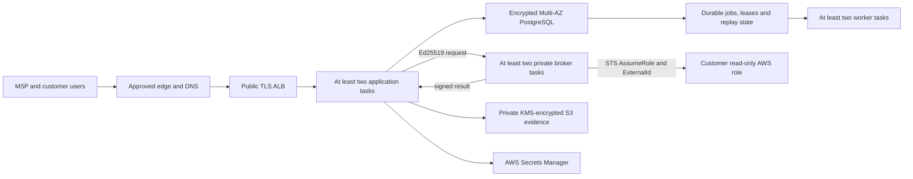

# Sutra hosted production foundation

**Status:** managed-production architecture and release automation are implemented
in source; no repository check proves a deployment or live production acceptance.

**As of:** 2026-07-30

The authoritative deployment contract is
[`../deploy/production/README.md`](../deploy/production/README.md). The
single-host EC2, Cloudflare Worker/D1 and local PostgreSQL paths remain supported
for development, staging and private-beta operation; they are not the
managed-production topology.

## Selected managed-production target

`infrastructure/production-ha.yaml` defines the availability, network, database,
evidence, secret, logging, backup, WAF and GitHub OIDC boundaries. Application,
notification-worker and broker images are released as one protected operation by
`.github/workflows/production-ha-release.yml`.

The hosted broker never accepts a caller-selected role or durable AWS key. It
resolves a tenant-bound connection from PostgreSQL, uses workload identity and
short-lived STS, rejects replay, and shares operation leases across replicas.
The local HMAC/fixture broker is unavailable unless `SUTRA_LOCAL_MODE=true`.

## Implemented source controls

The following means code, migrations and contract tests exist. It does not mean a
customer environment or external provider has accepted the integration.

- **Hosted identity:** OIDC authorization-code flow with S256 PKCE, strict
  issuer/JWKS/token validation, opaque server sessions, idle/absolute expiry,
  invitation-only membership and password/self-signup disabled in hosted mode.
- **Enterprise federation:** SAML 2.0 metadata, signed request/callback handling,
  audience/recipient/time validation and durable one-use assertion replay
  protection.
- **Provisioning:** SCIM 2.0 Users and Groups with organization-bound bearer
  credentials, customer assignments, suspension/session revocation and
  tenant-safe lifecycle persistence.
- **Authorization:** centralized membership/capability checks and organization plus
  customer predicates across web, public API, job, export and evidence paths.
- **Durable work:** PostgreSQL-backed jobs, leases, retries, dead-letter behavior,
  hosted collection jobs and a production job-runner sidecar.
- **Broker boundary:** separate Ed25519 request and response identities,
  tenant/connection/job binding, replay rejection, bounded payloads and private
  broker load balancing.
- **Managed integration credentials:** Jira/ServiceNow HMAC secrets are created in
  AWS Secrets Manager; only scoped references are persisted, and dispatch/inbound
  verification resolve the managed value.
- **Private evidence:** immutable, checksummed, size-bounded S3 objects using
  SSE-KMS; tenant/actor/purpose-bound grants are digest-only, expiring and
  single-use; reads verify returned bytes.
- **Agentless execution:** an approved plan can be handed to the hosted collector,
  durable broker terminal state can be reconciled, and failure/teardown ownership
  cannot be presented as a clean scan. It remains an opt-in write exception with a
  restrictive STS session ceiling and explicit delete denies.
- **Release mechanics:** immutable image digests, SBOM/provenance and scan gates,
  migration-first rollout, health/digest verification, coordinated service rollback
  and encrypted release evidence.

## External activation and acceptance gates

These cannot be closed by source changes alone:

1. Deploy and review the CloudFormation change set in the selected AWS management
   account, enable termination protection and capture the deployed task, policy,
   bucket and database configuration.
2. Configure the selected OIDC and/or SAML IdP plus SCIM client, then pass login,
   logout, MFA/step-up, user/group assignment, suspension and recovery tests.
3. Run the same live authorization matrix with two organizations and at least two
   customers each, including ID swaps in routes, jobs, exports, caches and evidence
   grants.
4. Onboard a disposable AWS sandbox role and pass correct, omitted and wrong
   ExternalId probes, account/partition checks, collection, retry and offboarding.
5. Run an end-to-end agentless scan in the approved sandbox, prove teardown and
   cleanup handoff, confirm billed resources return to zero and set the operator
   attestation only from retained evidence.
6. Configure real Jira/ServiceNow and notification-provider secrets, prove outbound
   delivery, inbound verification, replay rejection, rotation and vendor failure
   recovery.
7. Exercise private S3 evidence write, grant, download, expiry/replay denial,
   checksum failure and audit behavior against the deployed bucket and KMS policy.
8. Complete AZ/capacity, backlog/autoscaling, database restore, secret/key rotation,
   failed-release rollback, alert-response, load and penetration tests.

The detailed acceptance ledger is
[`production-acceptance-evidence.md`](production-acceptance-evidence.md).

## Environment separation

Development, staging and production use separate AWS accounts or rigorously
separated principals, databases, buckets, KMS keys, Secrets Manager paths, broker
key pairs, IdP applications and customer roles. Production tasks must fail closed
for loopback broker URLs, shared-secret broker mode, local authentication,
unmanaged secrets, mutable image tags or a public origin mismatch.

Passing repository checks validates the checked-in design and behavioral contracts.
Only retained evidence from the selected live environment can approve a production
release.
